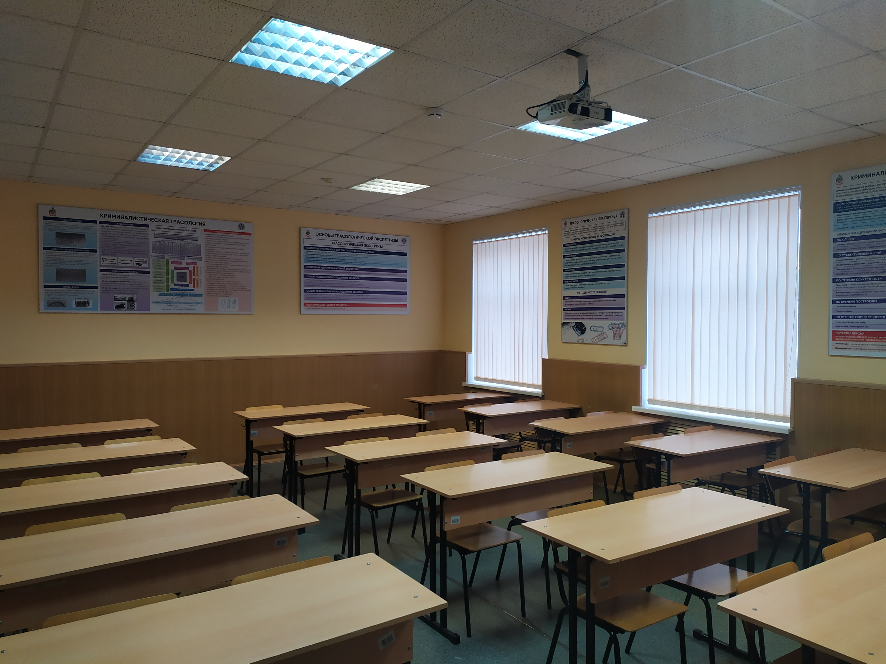
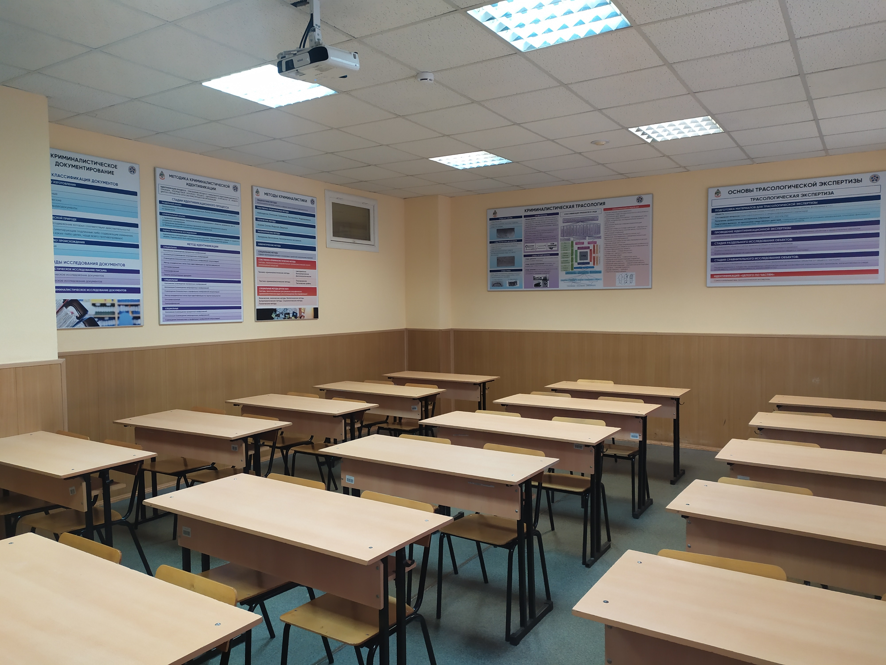

# Учебная аудитория 340 (кабинет криминалистики)

### Место расположения:
Главный учебный корпус, помещение 340

### Назначение кабинета: проведения лекций, семинаров, практических занятий и консультаций по дисциплинам:
1.	Криминалистика.
2.	Теория судебной экспертизы.
3.	Судебная фотография и судебная видеозапись.
4.	Трасология и трасологические исследования.
5.	Криминалистическое исследование веществ, материалов и изделий.

Основная цель деятельности кабинета – оптимизация учебного процесса, повышение качества преподавания криминалистики и ряда дисциплин судебно-экспертной направленности, совершенствование самостоятельной работы обучающихся в аудиторное и во внеаудиторное время.
Основные задачи работы кабинета:
- расширение знаний обучающихся в области криминалистики и судебной экспертизы;
- конкретизация и уточнение представлений обучающихся в сфере применения специальных познаний на всех стадиях расследования преступлений;
- формирование у обучающихся теоретических знаний, связанных с производством различных следственных и иных процессуальных действий;
- оказание методической помощи преподавателям в подготовке и проведении занятий.

### Назначение: 
проведение теоретических, практических занятий и упражнений по дисциплинам: 

**1) специальности 40.05.03 Судебная экспертиза:**
- криминалистика;
- криминалистическое исследование веществ, материалов и изделий;
- судебная фотография и видеозапись;
- трасология и трасологические экспертизы;
- пожарно-техническая экспертиза.

**2) специальности 20.05.01 Пожарная безопасность:**
- расследование пожаров;
- экспертиза пожаров.

**3) специальности 20.03.01 Техносферная безопасность (с учетом года набора обучающихся):**
- экспертиза пожаров;
- расследование пожаров.

### Оснащение учебной аудитории позволяет отработать вопросы:
- осмотр места происшествия, в том числе пожара, с применением технических средств фиксации (криминалистическая фото-видео сьемка; выявление, фиксация и изъятие следов человека, автотранспорта и др.);
- особенности изъятия и упаковки следов-носителей криминалистически значимой информации;
- применение на практике криминалистических приборов и оборудования (ультразвукового дефектоскопа, коэрцитиметра, тепловизора и др.);
- исследование после пожара металлических (преимущественно стальных) конструкций, а также различных металлических крепежных изделий с целью установления на пожаре зон наибольших термических повреждений;
- поиск на месте пожара зон, в которых превышена концентрация газопаровоздушных смесей на основе ЛВЖ и ГЖ (используемых злоумышленниками в качестве инициаторов горения), а также определение концентрации паров светлых нефтепродуктов, спиртов, ацетона, аммиака;
- отработка версий о поджоге, поиск очага пожара, а также реконструкция возникновения и распространения горения, аварийных ситуаций;
- криминалистическая фото-видео сьемка;
- выдвижение следственных версий по составам правонарушений.
- производство нормативной пожарно-технической экспертизы (соответствие объекта исследования требованиям пожарной безопасности);
- производство следственных действий и особенности работы межведомственных СОГ.

Более детально вы сможете ознакомиться перейдя по ссылке на видеосюжет: ***ддд***
